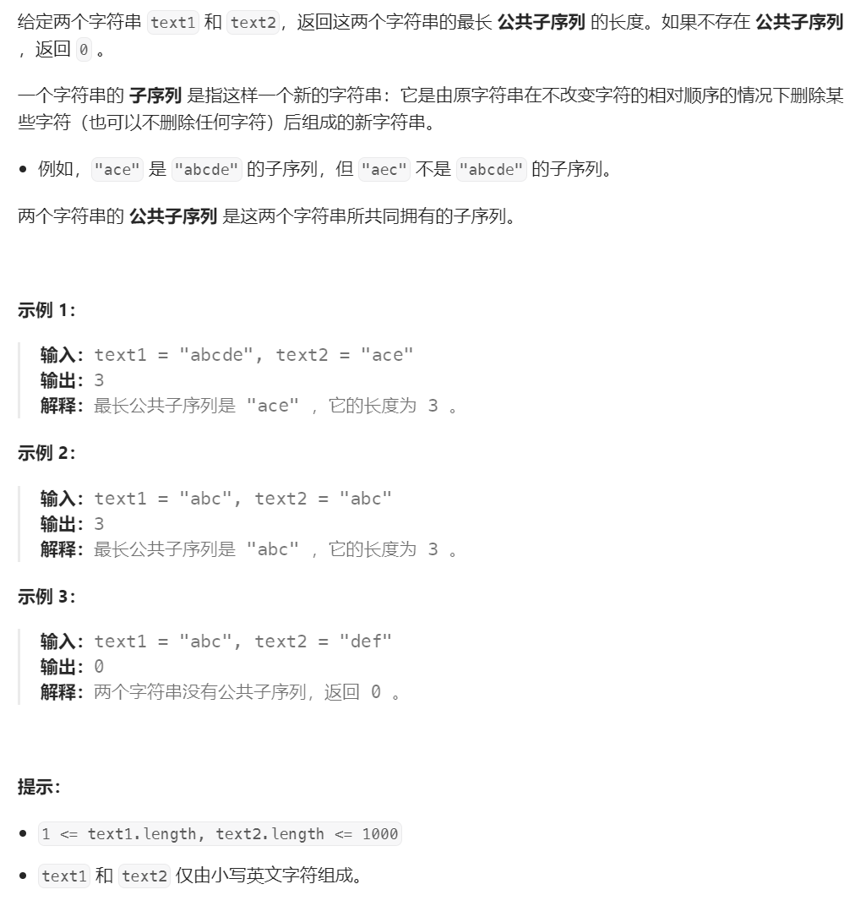

# LeetCode 1143. 最长公共子序列


# 题解
这题能动态规划出来我是想不到的，我这脑回路也就能想到排列组合，然后穷举了。直接看题解，发现答案非常简洁（但不简单）

## 1. 确认状态转移方程（其中same(a,b)，当两个字符串的第a位和第b位完全相同时为1，否则为0）
$$
f[i][j]=max\{f[i-1][j-1]+same(i,j),f[i-1][j],f[i][j-1]\}
$$

* 状态转移方程套用：
```cpp
int longestCommonSubsequence(const string& text1, const string& text2) {
    // 这里没有用递归，所以需要一个m*n的大数组来保存中间状态
    vector<vector<int>> dp(text1.size(), vector<int>(text2.size()));
    // 两层大循环遍历所有子串最大公共子串长度
    for (int i = 0; i < text1.size(); i++) {
        for (int j = 0; j < text2.size(); j++) {
            // 状态转移方程套用：
            if (text1[i] == text2[j]) {
                dp[i][j] = dp[i - 1][j - 1] + 1;
            } else {
                dp[i][j] = std::max(dp[i - 1][j], dp[i][j - 1]);
            }
        }
    }
    return dp[text1.size()-1][text2.size()-1];
}
```

## 2. 确定初始条件（索引从1开始）
$$
f[1][1]=same(1,1)
$$

* 初始化公式套用
```cpp
int longestCommonSubsequence(const string& text1, const string& text2) {
    // 这里没有用递归，所以需要一个m*n的大数组来保存中间状态
    vector<vector<int>> dp(text1.size(), vector<int>(text2.size()));

    // 初始条件
    dp[0][0] = text1[0] == text2[0] ? 1 : 0;

    // 两层大循环遍历所有子串最大公共子串长度
    for (int i = 0; i < text1.size(); i++) {
        for (int j = 0; j < text2.size(); j++) {

            // 状态转移方程套用：
            if (i == 0) {
                if (j > 0) {
                    if (text1[i] == text2[j]) {
                        dp[i][j] = dp[i][j - 1] + 1;
                    } else {
                        dp[i][j] = dp[i][j - 1];
                    }
                }
                continue;
            }
            
            if (j == 0) {
                if (i > 0) {
                    if (text1[i] == text2[j]) {
                        dp[i][j] = dp[i - 1][j] + 1;
                    }
                    else {
                        dp[i][j] = dp[i - 1][j];
                    }
                }
                continue;
            }

            if (text1[i] == text2[j]) {
                dp[i][j] = dp[i - 1][j - 1] + 1;
            } else {
                dp[i][j] = std::max(dp[i - 1][j], dp[i][j - 1]);
            }
        }
    }
    return dp[text1.size()-1][text2.size()-1];
}
```

## 3. 优化（一上来就整那么长的代码，我是一行也不想看）


# 参考
[1] Longest common subsequence https://en.wikipedia.org/wiki/Longest_common_subsequence